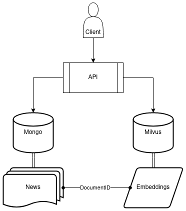

# Observatory
Observatory is a part of a team-developed project to collect and analyze news.



## Installing
```bash
git clone https://github.com/hott-henrique/Observatory.git
cd Observatory
pip install -r requirements.txt
```

## Running the servers
In order to the archtecture work properly two servers must be running: Milvus Lite and the API.

### Milvus Lite
```bash
mkdir -p .milvus
milvus-server --data .milvus
```

### API
```bash
export JOURNALIST_USER="MONGODB_USER" && export JOURNALIST_PWD="MONGODB_USER_PASSWORD"
uvicorn --host 0.0.0.0 --port 8080 app.main:app
```

## Testing
```bash
export API_BASE_URL="http://ADDRESS:PORT"
python3 examples/post-news.py
```
